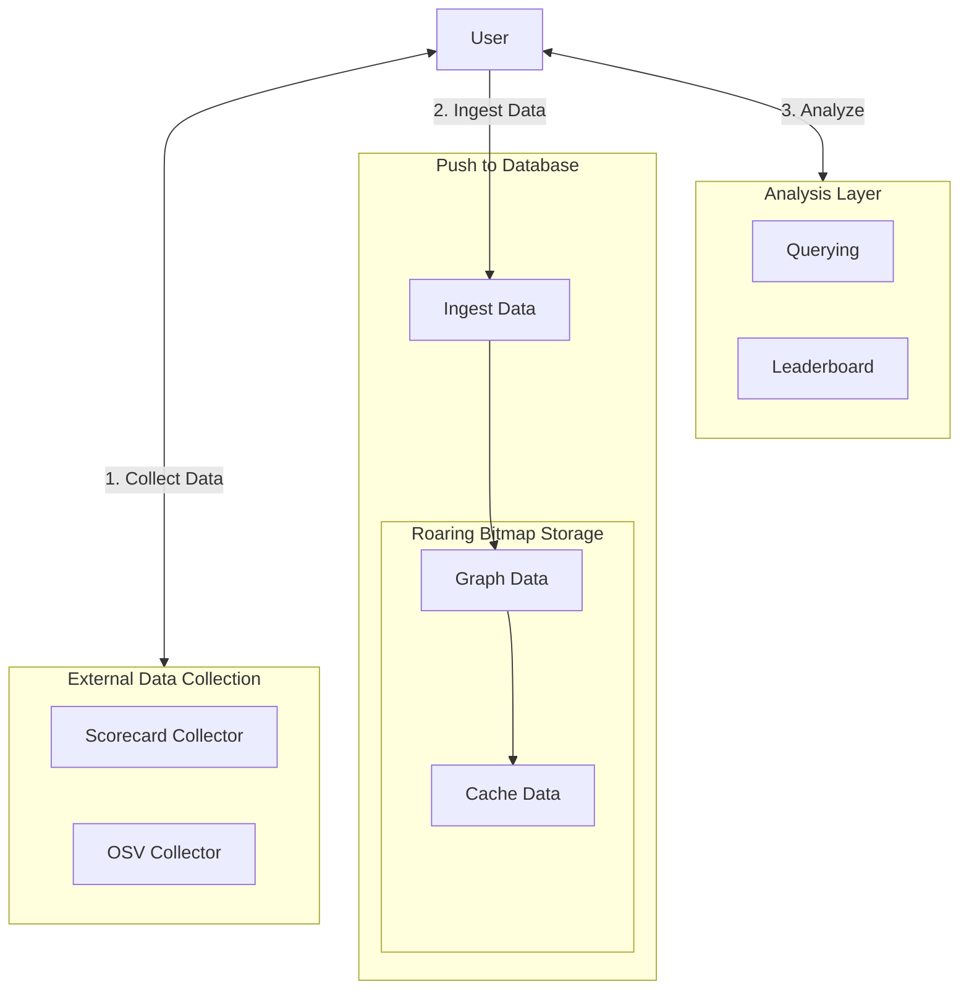

# Welcome to BitBom

🚀 **High-Performance SBOM Analysis at Scale**

BitBom Minefield is a powerful, air-gapped solution for analyzing Software Bill of Materials (SBOM) using advanced roaring bitmap technology.

## Why Minefield? {#why-minefield}

📊 **Lightning-Fast Analysis**
- Process and analyze millions of package relationships in seconds
- Uses Roaring Bitmaps for optimized bitmap operations
- Efficient caching system for insanely fast queries

🔒 **Air-Gapped by Design**
- Fully operational in isolated environments
- No external network dependencies
- Complete data sovereignty and control

📈 **Built for Scale**
- Handle millions of nodes effortlessly
- Efficient memory utilization
- Optimized for large enterprise SBOM datasets

🛠️ **Extensible Architecture**
- Custom query capabilities
- Pluggable visualization options
- Extend functionality without upstream changes

## Quick Start ⚡ {#quick-start}

Get started with BitBom in four simple steps:

1. Clone the repository:
```bash
git clone git@github.com:bitbomdev/minefield.git
cd minefield
```

2. Start the service:
```bash
go run main.go start-service
```

3. Ingest your SBOM data:
```bash
go run main.go ingest sbom <sbom_file or sbom_dir>
```

3. Cache for optimal performance:
```bash
go run main.go cache
```

4. Start querying:
```bash
go run main.go query <query_string>
```

## Core Features {#core-features}

### Advanced Querying
```bash
# Find all dependents of a package
go run main.go query custom "dependents library pkg:redis@6.2.0"

# Analyze shared dependencies
go run main.go query custom "dependencies library pkg:lib-A@1.0.0 and dependencies library pkg:lib-B@1.0.0"
```

### Leaderboard Analytics
```bash
# Generate dependency leaderboards
go run main.go leaderboard custom "dependents library pkg:lib-A@1.0.0"
```

## Architecture Overview {#architecture}

BitBom uses a sophisticated architecture built around roaring bitmaps for high-performance SBOM analysis:

<div align="center">



</div>

The core of BitBom's performance comes from its use of roaring bitmaps:

- **Efficient Storage**: Package relationships are stored as bitmap indices where each bit represents a dependency relationship
- **Fast Operations**: Roaring bitmaps enable lightning-fast AND/OR operations for querying complex dependency relationships
- **Memory Optimization**: The bitmap format provides compressed storage while maintaining quick access
- **Scalable Queries**: Bitmap operations scale efficiently with the size of the dependency graph

For example, when finding common dependencies between packages or calculating transitive dependencies, BitBom performs bitmap intersections and unions that are highly optimized by the roaring bitmap data structure.

## Community

🌟 If you find BitBom useful, please consider giving us a [GitHub star](https://github.com/bitbomdev/minefield)!

Join our community:
- [Issue Tracker](https://github.com/bitbomdev/minefield/issues)

## License

BitBom is available under the [Apache-2.0 License](https://github.com/bitbomdev/minefield/blob/main/LICENSE).
